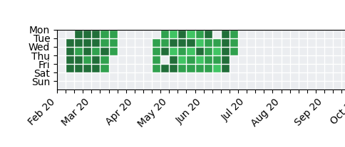

# Google Location History Office Days

Based on Google Location History, get the days you were in the office similar to GitHub contributions heatmap.

Color scale:

-  wasn't there at all
-  >= 2h
-  >= 4h
-  >= 6h
-  >= 8h

Default radius: 150 meters.

## Usage

1. Download your Google Location History (Timeline) from [Google Takeout](https://takeout.google.com/settings/takeout).
1. `git clone https://github.com/Maxim-Mazurok/google-location-history-office-days`
1. Unzip, find `Records.json` and copy it to `data` folder inside of the `google-location-history-office-days` folder.
1. Install dependencies: `pip install -r requirements.txt` (not all of them are necessary, you can skip this step and install only the ones you need later if you get an error)
1. Find your office location (latitude and longitude) and update `parse.py`, see `target_latitude` and `target_longitude` variables. You can right-click on Google Maps, click on coordinates to copy (include all the digits when pasting).
1. Parse data: `python parse.py` (it may take a while)
1. Generate heatmap: `python chart.py`

Also you can use `office-days.py` to get the number of days/hours you were in the office in the last financial year to help with your tax return.

Note: it shows data in Sydney timezone, you may need to adjust it in `parse.py` if you are in a different timezone.

## Disclaimer

This project is for educational purposes only. I do not take any responsibility for the accuracy or any other issues caused by the use of this project.

Most of the code was written with ChatGPT 4o and ChatGPT 4o with canvas (beta).

It might be missing something, maybe using `Semantic Location History` and look for `"semanticType": "TYPE_WORK"` would work better, this project relies on the "raw" data.
